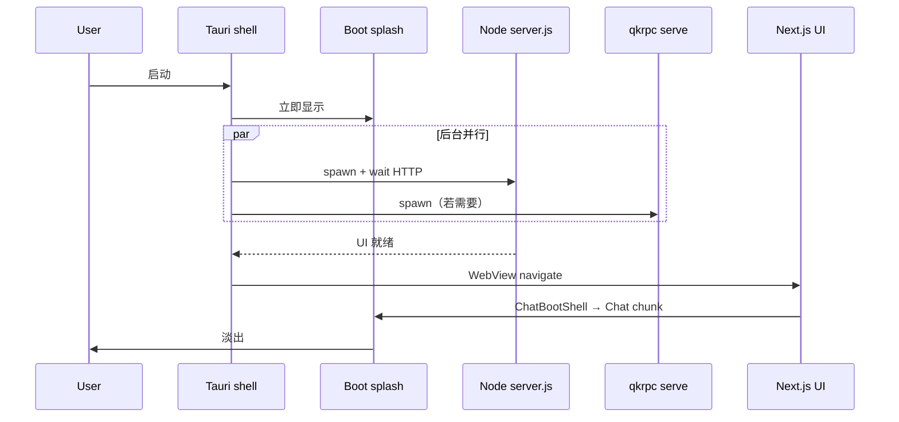

# QuickerAgent 启动性能

> 面向维护者：Tauri 桌面壳与 Next.js 前端的 **冷启动链路**、延迟策略与相关源码入口。用户侧目标：**尽快出现可交互界面**，后台服务并行拉起，尽量避免主线程/WebView 无响应。

## 1. 设计原则

| 原则 | 做法 |
|------|------|
| **先壳后服务** | Tauri 主窗口 + 占位 splash 立即显示；qkrpc / Node UI / 语音 runtime 在后台线程启动 |
| **能懒则懒** | 开发 Tauri 不阻塞等 qkrpc；语音/剪贴板/launcher 预创建默认延后 |
| **并行不串行** | 生产环境 qkrpc serve 与 Node `server.js` 同时 spawn；语音 runtime 升级与 UI 启动并行 |
| **首屏轻量** | `Chat` 动态 import；localStorage 聊天恢复放到 `requestIdleCallback` |
| **感知 > 绝对耗时** | 双层 splash（Tauri 占位 HTML + Next 内联 boot splash）覆盖编译/加载空窗 |

---

## 2. 启动阶段总览

### 2.1 生产安装包（Release Tauri）

```text
用户双击 QuickerAgent.exe
  → 单实例检查（已有实例则激活前台窗口）
  → Tauri setup：主窗口 show + 占位页 placeholder/index.html（splash）
  → 托盘 / 全局快捷键：延后到首帧之后（spawn_desktop_chrome_deferred）
  → 后台线程 spawn_production_startup：
       ├─ prepare_production_runtime（解析 bundled node、qkrpc、UI 端口）
       ├─ 并行：spawn_qkrpc_background
       ├─ 并行：spawn_node_background → wait HTTP 200 → navigate 到 http://127.0.0.1:3000
       └─ 并行：语音 runtime 待应用升级（apply_pending_runtime_upgrade）
  → WebView navigate 到 Node 服务
  → Next 渲染：内联 boot splash → ChatBootShell → Chat 懒加载
  → splash 淡出，主界面可交互
  → 语音 / 剪贴板 runtime（若已安装且 autoStart）再延迟数秒后台启动
```

### 2.2 开发桌面壳（`pwsh ./dev.ps1 -Tauri`）

```text
tauri dev 触发 beforeDevCommand（scripts/tauri-before-dev.mjs）
  → start.mjs --dev --webpack（AGENT_GUI_TAURI_SHELL=1）
       ├─ 不阻塞 ensureBundledQkrpcServe（qkrpc 由 /api/ping 懒启动）
       └─ 启动 Next webpack dev server
  → 仅等待 :3000 端口监听即放行（不等 webpack 完整编译 /）
  → Tauri 窗口打开 devUrl，显示 Next boot splash
  → webpack 在后台继续编译首屏；用户仍看到 splash，无白屏
```

与浏览器 dev（`pwsh ./dev.ps1`）的区别：Tauri 强制 **webpack**（非 Turbopack），且 WebView2 内 HMR 被静音（见 `lib/tauri-dev-hmr-mute-script.ts`）。

---

## 3. 架构示意



---

## 4. 关键文件

| 路径 | 职责 |
|------|------|
| `agent-gui/src-tauri/src/lib.rs` | 生产启动编排、`resolve_qkrpc_port`、HTTP 就绪探测、`open_production_ui` |
| `agent-gui/src-tauri/placeholder/index.html` | 生产首屏占位 splash（navigate 前可见） |
| `agent-gui/scripts/tauri-before-dev.mjs` | dev 时 beforeDevCommand：端口就绪即放行 Tauri |
| `agent-gui/start.mjs` | dev 服务入口；Tauri 模式跳过阻塞 qkrpc |
| `agent-gui/lib/app-bootstrap-splash-markup.ts` | Next 内联 splash HTML + 自动 dismiss 脚本 |
| `agent-gui/components/shell/AppBootstrapSplash.tsx` | React 侧 splash 备份 dismiss + idle 聊天恢复 |
| `agent-gui/components/shell/ChatBootShell.tsx` | `Chat` 动态加载前的轻量 `.app-shell` 骨架 |
| `agent-gui/app/page.tsx` | `dynamic()` 懒加载 `Chat` |
| `agent-gui/src-tauri/src/launcher.rs` | Launcher 预创建（默认关闭，见环境变量） |
| `agent-gui/src-tauri/src/voice_plugin.rs` | 语音 runtime 延迟 5s 后台任务 |

---

## 5. Boot splash 行为

两层 splash 共用视觉样式（`app-bootstrap-splash`）：

1. **Tauri 占位页**（仅生产，navigate 前）：Rust 通过 `emit_startup_status` 更新 `.startup-message` 文案（如「正在启动界面服务…」）。
2. **Next 内联 splash**（`layout.tsx` 注入）：在 React hydrate 前即可见；内联脚本监听 `.app-shell` / `.launcher-route-shell` 出现后淡出。

Dismiss 逻辑（`APP_BOOTSTRAP_SPLASH_DISMISS_SCRIPT`）：

- `/launcher` 路由：`data-app-boot-skip` 立即跳过
- 主界面：检测到 `.app-shell` 后淡出（最短约 80ms，最长 6s 强制消失）
- `document.documentElement.dataset.appReady = "1"` 后，更新检查等后台任务才运行（`waitForAppInteractive`）

`prefers-reduced-motion: reduce` 时关闭 splash 动画，减轻 WebView2 GPU 压力。

---

## 6. 延迟 / 懒启动清单

| 能力 | 策略 | 触发时机 |
|------|------|----------|
| qkrpc serve（Tauri dev） | 不随 `start.mjs` 阻塞启动 | 首次 `/api/ping` |
| qkrpc serve（生产） | 后台 spawn；9477 已有则复用 | `spawn_qkrpc_background` |
| 语音 ASR runtime | 安装包默认 `autoStart`；dev 不自动下载 | UI 就绪后 + 5s 延迟线程 |
| 剪贴板 history runtime | 后台 spawn | UI 就绪后 |
| Launcher 窗口预创建 | **默认关闭** | `QUICKER_AGENT_PREWARM_LAUNCHER=1` 时 UI 就绪 15s 后 |
| 聊天 localStorage | `requestIdleCallback` | splash dismiss 之后 |
| 聊天 legacy LevelDB 恢复 | 异步，不阻塞 splash | `maybeAutoRestoreChatStoreOnBoot` |
| 托盘 + `Alt+Space` 快捷键 | 延后到主窗口 show 之后 | `spawn_desktop_chrome_deferred` |
| 语音 runtime 升级包应用 | 与 UI 启动并行 | `spawn_pending_voice_runtime_upgrade_background` |

---

## 7. 生产环境 qkrpc 端口解析

`resolve_qkrpc_port`（`lib.rs`）：

1. 对 `9477` 做 **短探测**（约 350ms）看是否已有 serve
2. 若无响应且端口可 bind → 在 9477 上 spawn
3. 若端口被占用 → `find_port` 找下一个空闲端口

HTTP 就绪轮询：前 3 秒 80ms 间隔，之后 200ms，避免空等。

---

## 8. 环境变量与调优

| 变量 | 作用 |
|------|------|
| `AGENT_GUI_TAURI_SHELL=1` | `start.mjs`：dev 不阻塞 qkrpc；`next.config` webpack watch 聚合 |
| `AGENT_GUI_REUSE_DEV=1` | `tauri-before-dev` 复用已有 :3000 前端 |
| `AGENT_GUI_VOICE_RUNTIME=1` | dev 启动时 eager 拉起语音 runtime |
| `QUICKER_AGENT_PREWARM_LAUNCHER=1` | 生产 UI 就绪后预创建隐藏 launcher 窗（可能短暂影响主 WebView） |
| `AGENT_GUI_TURBOPACK=0` | Tauri dev 强制 webpack（默认） |

---

## 9. 常见问题

**Tauri dev 窗口打开后长时间停在 splash**

- 正常：webpack 首次编译 `/` 可能 30–120s；splash 应持续显示而非白屏。
- 查 webpack 终端编译错误，或端口 3000 是否被其他进程占用。

**生产启动卡在「正在启动界面服务…」**

- bundled `resources/app/server.js` 或 `node.exe` 缺失 → 安装不完整。
- 查 `%LOCALAPPDATA%` 下 QuickerAgent 日志或 Windows 事件；Node 子进程 60s 内未响应 `/` 会弹窗报错。

**qkrpc 红点 / ping 失败但 UI 已开**

- 预期：UI 不等待 Quicker 插件；serve 进程起来即可（`/health` 中 `"ok":false` 亦视为监听成功）。
- 用户需自行启动 Quicker 并加载 QuickerRpc 插件。

**关闭启动 splash 后主界面闪一下**

- 检查是否同时存在占位 splash 与 Next splash 未正确 handoff；看 `data-app-ready` 是否过早设置。

---

## 10. 相关文档

- [agent-gui/README.md](../agent-gui/README.md) — 开发 / 发布入口
- [agent-gui-launcher.md](agent-gui-launcher.md) — Launcher 与全局快捷键
- [agent-gui-plugin-storage.md](agent-gui-plugin-storage.md) — 语音等插件目录
- [voice-input-plugin.md](voice-input-plugin.md) — 语音服务产品与协议
- [dev-supervisor-design.md](dev-supervisor-design.md) — `dev.ps1` 监督进程
