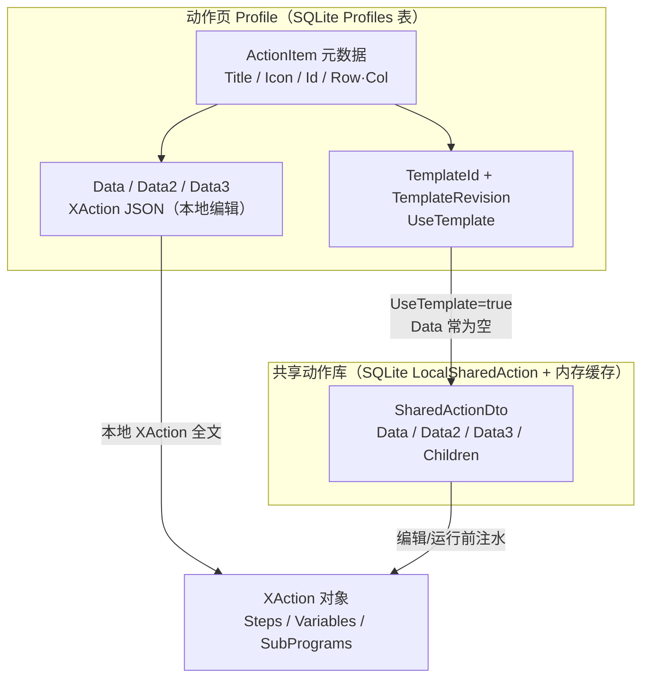
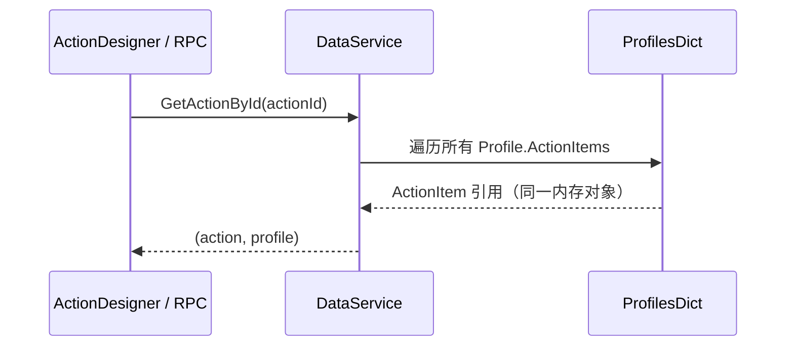
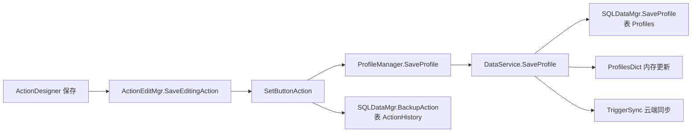
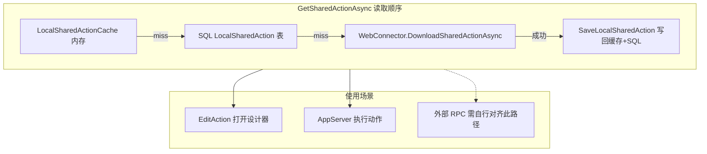
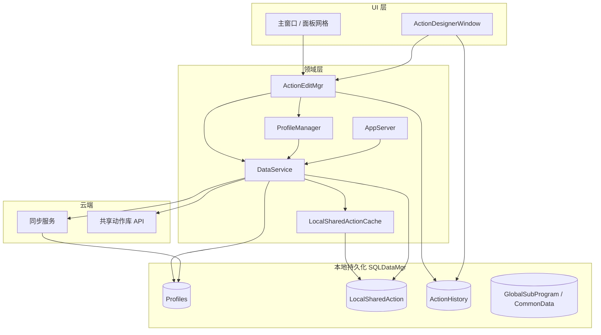
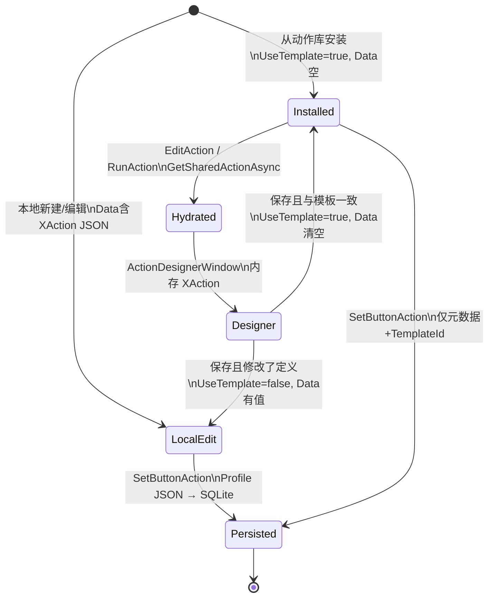

# Quicker 动作数据存储架构

本文基于 `.ref/Quicker` 源码（`dev` 分支）梳理 **动作（ActionItem）** 从设计器编辑到持久化、共享动作库与运行的数据流，重点对应 `ActionDesignerWindow`、`ActionEditMgr`、`DataService`、`SQLDataMgr`。

> 源码根：`.ref/Quicker/QuickerPc/Quicker/`  
> 公共模型：`.ref/Quicker/QuickerPc/Common/Quicker.Common/`

---

## 1. 总览：三层存储 + 两类程序正文

Quicker 把「面板上的按钮」和「按钮背后的程序正文」分开管理：

| 层级 | 载体 | 存什么 | 典型 API |
|------|------|--------|----------|
| **内存（运行时）** | `DataService.ProfilesDict` | 已加载的 `ActionProfile` 列表，每个含 `ActionItem[]` | `GetActionById`、`ProfilesDict` |
| **本地 SQLite** | `SQLDataMgr` | 动作页 JSON、共享动作包、编辑历史、公共子程序等 | `SaveProfile`、`GetSharedAction`、`BackupAction` |
| **云端** | 同步服务 + 动作库 CDN | 动作页同步、共享动作下载/备份 | `TriggerSync`、`DownloadSharedActionAsync` |

程序正文（XAction：步骤/变量/子程序）的存放方式分 **两条路径**：



---

## 2. 核心数据模型

### 2.1 `ActionItem`（面板格子上的动作）

定义：`Common/Quicker.Common/ActionItem.cs`

| 字段 | 含义 |
|------|------|
| `Id` | 本地面板内动作实例 GUID |
| `ActionType` | 类型（`XAction`、运行程序、打开文件等） |
| `Title` / `Icon` / `Description` | 展示与搜索 |
| `Data` / `Data2` / `Data3` | **主程序参数**；对 `XAction` 为 **整份 XAction 的 JSON**（大动作可拆分字段） |
| `Children` | 子动作列表（部分类型） |
| `TemplateId` | **动作库中的共享动作 ID**（注释写明等价于共享 store id） |
| `TemplateRevision` | 共享动作版本号 |
| `UseTemplate` | `true` 表示**未改定义**，正文不在 `Data` 里，运行/编辑时从共享库加载 |
| `SharedActionId` | 本动作**分享出去**后的共享 id（与 `TemplateId` 用途不同） |
| `Row` / `Col` | 在 `ActionProfile` 网格中的位置 |

### 2.2 `ActionProfile`（动作页）

- 一个「动作页」= 一个 `ActionProfile`，内含 `List<ActionItem> ActionItems`。
- **持久化单位是整个 Profile**：序列化为一条 JSON 写入 `Profiles` 表，而不是每个 `ActionItem` 单独一行。
- 启动时 `DataService.StartUp()` → `SQLDataMgr.LoadLocalData()` → 反序列化后填入 `ProfilesDict`。

### 2.3 `XAction`（组合动作程序）

定义：`Actions/XActions/XAction.cs`

- `Steps`：步骤列表  
- `Variables`：变量  
- `SubPrograms`：内嵌子程序  

设计器里编辑的是内存中的 `XAction` 对象；保存时序列化进 `ActionItem.Data`（Newtonsoft 默认 **PascalCase** 属性名：`Steps`、`Variables`）。

### 2.4 `SharedActionDto`（动作库中的一条共享动作）

定义：`Common/.../Vm/SharedAction/SharedActionDto.cs`

- 与 `ActionItem` 类似也有 `Data` / `Data2` / `Data3` / `Children`。
- 安装到面板时 `CreateActionItem(useLocalSharedAction: true)` 会设 `UseTemplate=true`、`Data=null`、`TemplateId=共享 Id`（见 DTO 内 `CreateActionItem`）。

---

## 3. 运行时内存：查找动作 ≠ 加载正文



实现：`DataService.GetActionById`（约 2705 行）**只做 ID 匹配**，**不会**因 `UseTemplate` 去拉共享库。

因此：

- `GetActionById` 返回的 `ActionItem.Data` 可能为 **空或 null**（链接动作库安装的典型状态）。
- 要拿到 XAction 正文，必须走 **编辑打开** 或 **执行前注水**（见下文 §5、§6）。

---

## 4. 设计器（ActionDesignerWindow）读写路径

### 4.1 打开编辑：`ActionEditMgr.EditAction`

源码：`Domain/Services/ActionEditMgr.cs`（约 297–472 行）

```mermaid
flowchart TD
    A[EditAction 入口] --> B{新建 XAction?}
    B -->|是| C[CreateActionItem + 可选 _template_]
    B -->|否| D{UseTemplate 且 TemplateId 非空?}
    D -->|是| E[克隆 ActionItem]
    E --> F["GetSharedActionAsync(TemplateId, TemplateRevision)"]
    F --> G["editingItem.Data ← shared.Data<br/>+ Data2/Data3/Children"]
    G --> H["UseTemplate=false（仅编辑副本）"]
    D -->|否| I[editingItem = 原 ActionItem]
    H --> J[new ActionDesignerWindow(sqlDataMgr, editingItem)]
    I --> J
```

要点：

- **共享链接动作**在打开设计器前才把 `SharedActionDto` 注入 `editingItem.Data`。
- 设计器构造函数接收的已是「带正文的 `ActionItem`」。

### 4.2 设计器内：`ActionDesignerWindow`

源码：`View/X/ActionDesignerWindow.xaml.cs`

| 阶段 | 行为 |
|------|------|
| 构造 | `EditingActionItem` = 传入项；`ResultActionItem = Clone(EditingActionItem)` |
| 加载 UI | 若 `ResultActionItem.Data` 为空 → 新建空 `XAction` + 默认变量；否则 `JsonConvert.DeserializeObject<XAction>(Data)` |
| 编辑 | 内存 `Action`（`XAction`）与 UI 双向绑定 |
| Ctrl+S / 保存 | `DoSaveWithoutClose` → `ActionEditMgr.SaveEditingAction(ResultActionItem)` + `SQLDataMgr.BackupAction` |

设计器 **不直接写 SQLite 动作页**；保存走 `ActionEditMgr` → `SetButtonAction` → `ProfileManager.SaveProfile`。

### 4.3 关闭设计器保存：`dlg.Closed`

`ActionEditMgr` 在对话框 `Result==true` 时（约 483–516 行）：

1. `updatedAction = dlg.ResultActionItem`
2. 若与打开时的共享模板 JSON **完全一致** → 恢复链接模式：`UseTemplate=true`，`Data=""`（仍不占面板 JSON 体积）
3. `SetButtonAction(profile, row, col, updatedAction)` → 持久化到 Profile

---

## 5. 持久化：动作页如何落盘



### 5.1 `SetButtonAction`

- 在 `profile.ActionItems` 中按 `(Row, Col)` 替换条目。
- 调用 `_profileManager.SaveProfile(profile)`（除非 `skipSave`）。

### 5.2 `DataService.SaveProfile`

约 1052–1106 行：

1. 收集页内所有 `TemplateId` 到 `profile.SharedActionIds`（用于同步/依赖追踪）。
2. `content = JsonConvert.SerializeObject(profile)` — **整页 JSON**。
3. 变更检测（`ProfileChangeChecker`）未变则跳过写库。
4. `_localDataMgr.SaveProfile(profileId, content, ...)` → SQLite `Profiles` 表 `INSERT OR REPLACE`。
5. `TriggerSync` 排队上传服务器。

### 5.3 编辑历史：`BackupAction`

- 设计器保存、删除前等会 `BackupAction(ActionItem, ActionBackupType)`。
- 将 **完整 `ActionItem` 序列化** 存入 `ActionHistory`（含当时 `Data` 快照）。
- 与「动作库链接」无关，用于版本回滚/恢复。

---

## 6. 共享动作库：第三条存储线



实现：`DataService.cs` 约 1652–1707 行；`LocalSharedActionCache.cs`；`SQLDataMgr.GetSharedAction`。

`LocalSharedAction` 表键：`(SharedActionId, Revision)`，值为序列化后的 `SharedActionDto`。

---

## 7. 执行动作时的正文来源

`AppServer` 执行前（约 748–761 行）：

```text
if (action.UseTemplate && TemplateId 非空)
    tempAction = action.Clone(false)
    shared = GetSharedActionAsync(TemplateId, TemplateRevision)
    tempAction.Data/Data2/Data3/Children ← shared
ActionTypeManager.RunAction(tempAction, ...)
```

与 `XActionRunner` 直接读 `action.Data` 一致：**必须先注水**，否则 `Data` 为空会报错。

---

## 8. 公共子程序（另一条设计器模式）

`ActionDesignerWindow` 在 `IsSubProgram=true` 时：

- 保存走 `TriggerCommandService.SaveGlobalSubProgram` + `ISyncService.TriggerSync`（**多账号配置云同步**，与动作页 `SaveProfile` 后 `TriggerSync` 同队列；非 getquicker 动作库分享）。
- 读取/枚举仍可用 `DataService.GetGlobalSubProgram` / `GlobalSubPrograms`。
- 与面板 XAction 是 **独立目录**（非 Profile 内 `ActionItem`）。

**类型/调用链查证**（勿引用本仓库外的 `quickerorg` 等路径）：维护者可选 `.ref/Quicker/`（见本文档开头）；否则 `dotnet test QuickerRpc.Plugin.Test --filter SaveGlobalSubProgram` 对 **本机 `Quicker.exe`** 做反射扫描（`quicker-exe-type-probing`）。

**quicker-rpc 无头保存**：`DataServiceSubProgramAccessor.TrySave` → `TriggerCommandSubProgramAccessor`（`QuickerTriggerCommandReflection` 解析 `SaveGlobalSubProgram`）；勿与 `SharedId` + `WebConnector.ShareActionAsync`（动作库分享）混淆。

---

## 9. 架构总图（组件关系）



---

## 10. 对 quicker-rpc / 无头读取的启示

| 场景 | 仅 `GetActionById` | 正确做法 |
|------|-------------------|----------|
| 本地编辑过的 XAction | 通常 `Data` 有 JSON | 直接读 `ActionItem.Data`，注意 **PascalCase** |
| 动作库安装（`UseTemplate`） | `Data` 为空 | `TemplateId` + `GetSharedActionAsync`（或 SQL `GetSharedAction`） |
| 设计器已打开 | 内存 `ResultActionItem` 最准 | 可读设计器窗口内对象 |
| 压缩 RPC 输出 | — | Quicker 正文 JSON → `XActionData`（`x_action_program.proto` + `JsonParser`）→ `TypedXActionCompressor` → agent wire JSON（`agent_compressed_program.proto` + `JsonFormatter`）；patch 路径仍用 `JArray` |

本仓库插件侧对应实现：`ActionDesignerProgramAccess`、`DataServiceSharedActionLoader`、`SharedActionProgramAccessor`（见 `QuickerRpc.Plugin/Services/`）。

---

## 11. 关键源码索引

| 主题 | 路径（相对 `.ref/Quicker/QuickerPc`） |
|------|--------------------------------------|
| 设计器加载/保存 UI | `Quicker/View/X/ActionDesignerWindow.xaml.cs` |
| 打开编辑、模板注水、SetButtonAction | `Quicker/Domain/Services/ActionEditMgr.cs` |
| 内存 Profile、GetActionById、SaveProfile、共享动作 | `Quicker/Domain/Services/DataService.cs` |
| Profile 保存入口 | `Quicker/Domain/Profiles/ProfileManager.cs` |
| SQLite Profiles / LocalSharedAction / ActionHistory | `Quicker/Domain/SQL/SQLDataMgr.cs` |
| 执行前模板注水 | `Quicker/Domain/Services/AppServer.cs` |
| ActionItem 字段语义 | `Common/Quicker.Common/ActionItem.cs` |
| 共享 DTO → ActionItem | `Common/.../SharedActionDto.cs` → `CreateActionItem` |
| XAction 结构 | `Quicker/Actions/XActions/XAction.cs` |
| 共享内存缓存 | `Quicker/Domain/Services/LocalSharedActionCache.cs` |

---

## 12. 状态小结（单动作生命周期）



以上即为 Quicker 在「动作设计器 + 动作页 + 动作库」三者之间的数据存储架构；外部工具若要无头读写 XAction，必须复现 **注水（TemplateId）** 与 **JSON 字段命名** 两条规则，而不能只依赖 `GetActionById().Data`。
