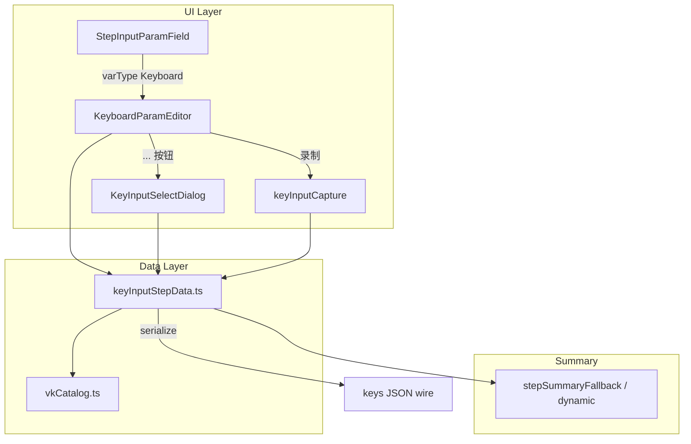

# agent-gui 模拟按键 A（sys:keyInput）支持设计

> 状态：草案 · 2026-06-16  
> 范围：`agent-gui/lib/action-editor` 步骤编辑、摘要、authoring 文档  
> 对齐基准：Quicker `KeyboardStepEditorWindow` + `KeyInputOrSelectControl` + `KeyInputStepData`

## 背景与问题

`sys:keyInput`（模拟按键 A）的 `keys` 参数类型为 `VarType.Keyboard`（`CsVarType.Keyboard = 7`）。  
Quicker 运行时将其解析为 **JSON 结构的 `KeyInputStepData`**，而非 SendKeys B 的 `{Ctrl}c` 语法。

当前 agent-gui：

| 能力 | 现状 |
|------|------|
| schema 识别 `valueType: Keyboard` | ✅ `step-runners-ui-catalog.json` |
| `keys` 专用编辑器 | ❌ 落入 `VarOrValueParamEditor`，用户需手写 JSON |
| 步骤列表摘要 | ❌ 显示原始 JSON 或截断字符串 |
| `authored/keyInput.md` 示例 | ❌ 误用 SendKeys 语法 |
| Agent 无头 patch | ⚠️ 依赖 `step-runner get`；文档需纠正 wire 格式 |

## 数据格式（Quicker 真源）

### Wire：`keys` 参数值

```json
{"CtrlKeys":[162],"Keys":[68]}
```

| 字段 | 类型 | 含义 |
|------|------|------|
| `CtrlKeys` | `number[]` | 修饰键 VK 码（Ctrl/Alt/Shift/Win 及左右区分） |
| `Keys` | `number[]` | 普通键 VK 码（可与修饰键组合发送） |

- 序列化：`JsonConvert.SerializeObject(KeyInputStepData)`（Newtonsoft；字段名 PascalCase）
- 执行：`InputSimulator.Keyboard.ModifiedKeyStroke(CtrlKeys, Keys, holdMs)`
- 空/缺省：`{"CtrlKeys":[],"Keys":[]}` → 摘要用 `<未设置>`

### 其它输入参数（已有通用 Integer 编辑器，无需重做）

| key | 默认 | 说明 |
|-----|------|------|
| `repeat` | `1` | 重复次数 |
| `interval` | `1` | 重复间隔 ms |
| `holdMs` | `-1` | 普通键保持时间；`-1` 用 Quicker 全局默认 |

### 常见 VK 示例

| 组合 | JSON |
|------|------|
| Ctrl+D | `{"CtrlKeys":[162],"Keys":[68]}` |
| Ctrl+C | `{"CtrlKeys":[162],"Keys":[67]}` |
| Enter | `{"CtrlKeys":[],"Keys":[13]}` |
| Win+Shift+S | `{"CtrlKeys":[91,160],"Keys":[83]}` |

> VK 使用 Windows `VirtualKeyCode` 整型（与 `WindowsInput.Native` 一致）。录制时记录**实际按下的左右修饰键**（如 Left Ctrl = 162），选择器勾选修饰键时写入通用码（Ctrl = 17），与 Quicker `KeySelectorWindow` 行为一致。

### 显示名（摘要/UI 标签）

对齐 `KeyboardHelper.GetKeysName`：

- 有修饰键：`Ctrl+Alt+ [ C ]`
- 无修饰键：`Enter,Tab`
- 空：`<未设置>`

单键显示名对齐 `KeyboardHelper.GetKeyName`（含 `←` `→` `Esc` `Backspace(退格)` 等自定义表）。

### 与 SendKeys B 的边界

| | 模拟按键 A (`sys:keyInput`) | 模拟按键 B (`sys:sendKeys`) |
|--|---------------------------|---------------------------|
| `keys` 格式 | `KeyInputStepData` JSON | SendKeys 字符串 |
| 动态内容 | 仅通过变量绑定 `keys` | 表达式 + SendKeys 语法 |
| 文本输入 | ❌（应用 `sendKeys` / `inputScript`） | ✅ |
| 已有 Web 编辑器 | 本设计 | `TextToolsParamEditor` + `SelectSendKeysData` |

## 桌面 UI 对照

Quicker 对 `StepType.Keyboard` 步骤**双击**打开专用窗 `KeyboardStepEditorWindow`（非通用步骤弹窗）：

```
按键组合  [ 显示名 ]
          [ 录制 ] [ ... ]     ← KeyInputOrSelectControl
保持时间   [-1]
循环次数   [1]
重复间隔   [1]
完成后延迟 [0]                  ← step.delayMs（弹窗级）
注释 / 停用
```

Web 侧 `StepEditorPopup` 已具备：`delayMs`、`note`、`disabled`、以及 `repeat`/`interval`/`holdMs` 整数字段。  
**缺口仅在 `keys` 的可视编辑与摘要美化。**

## 方案对比

### 方案 A：专用步骤弹窗（完全复刻桌面）

- 对 `sys:keyInput` 绕过 `StepEditorPopup`，打开 `KeyInputStepEditorDialog`
- 优点：与桌面布局 1:1
- 缺点：维护双套弹窗；与 Web 统一步骤编辑体验割裂；重复 delay/note 逻辑

### 方案 B：在 `StepInputParamField` 内嵌 `KeyboardParamEditor`（推荐）

- `keys` 字段走专用控件；`repeat`/`interval`/`holdMs` 继续用现有 Integer 行
- 优点：改动集中、与现有弹窗一致、可分阶段交付
- 缺点：布局与桌面专用窗不完全相同（可接受）

### 方案 C：仅改进摘要 + 文档，编辑器仍手写 JSON

- 优点：工作量最小
- 缺点：不满足「对齐桌面字段编辑」目标

**推荐：方案 B，分两阶段交付。**

## 推荐架构（方案 B）



### 新文件

| 文件 | 职责 |
|------|------|
| `steps/paramEditors/keyInput/keyInputStepData.ts` | `parse` / `serialize` / `formatKeysName` / `isKeyInputStepDataJson` |
| `steps/paramEditors/keyInput/vkCatalog.ts` | VK ↔ 显示名；选择器常用键列表；修饰键归一化 |
| `steps/paramEditors/keyInput/keyInputCapture.ts` | `KeyboardEvent` → `{ ctrlKeys, keys }`（录制） |
| `steps/paramEditors/keyInput/KeyInputSelectDialog.tsx` | 修饰键勾选 + 普通键列表（对齐 `KeySelectorWindow`） |
| `steps/paramEditors/keyInput/KeyboardParamEditor.tsx` | 显示名 + 录制 + `...` + 高级入口 |
| `*.test.ts` | 解析、摘要、捕获、往返序列化 |

### `keyInputStepData.ts` API（草案）

```ts
export type KeyInputStepData = {
  ctrlKeys: number[];
  keys: number[];
};

export function parseKeyInputStepData(raw: string): KeyInputStepData | null;
export function serializeKeyInputStepData(data: KeyInputStepData): string;
export function formatKeyInputKeysName(data: KeyInputStepData): string;
export function isKeyInputWireJson(raw: string): boolean;
```

- `parse`：容错空串 → 空结构；非法 JSON → `null`（触发高级/表达式回退）
- `serialize`：稳定字段顺序 `CtrlKeys`/`Keys`；空数组省略或显式 `[]`（与 Quicker 一致用显式数组）
- 不使用 SendKeys 语法转换

### `KeyboardParamEditor` 交互

```
┌─────────────────────────────────────────────┐
│ 按键    Ctrl+ [ D ]                         │
│         [ ● 录制 ] [ ... ]  [变量/表达式 ▾]   │
└─────────────────────────────────────────────┘
```

1. **显示名**：`formatKeyInputKeysName`；空时灰色 `<未设置>`
2. **录制**：按钮进入录制态；`keydown` 收集修饰键 + 主键；`keyup` 全部抬起后提交（对齐 `HotkeyInputControl`）
3. **`...`**：打开 `KeyInputSelectDialog`
4. **变量/表达式**（Phase 2）：切换到现有 `VarOrValueParamEditor`（`varKey` 或 `$=` 表达式）

录制约束（与桌面一致）：

- 修饰键进 `CtrlKeys`；非修饰进 `Keys`
- 支持多普通键（和弦）
- 忽略纯修饰键抬起前的中间态
- Electron 内录制需 `preventDefault`，避免触发编辑器快捷键

### `KeyInputSelectDialog`

对齐 `KeySelectorWindow`：

- 勾选：Ctrl / Alt / Shift / Win（写入 `CONTROL`/`MENU`/`SHIFT`/`LWIN`）
- 普通键列表：可增删；每项下拉选自 `vkCatalog` 常用键 + 字母数字 + F1–F12 + 方向键等
- 确定 → `serialize` 写回 `param.value`；取消丢弃

### 路由：`StepInputParamField`

在 `texttools` 分支之后、`shouldUseVarOrValueEditor` 之前插入：

```ts
if (vt === CsVarType.Keyboard && vm === ParamVariableMode.Input) {
  const raw = (param.value ?? "").trim();
  const boundVar = (param.varKey ?? "").trim();
  const forceAdvanced =
    boundVar.length > 0 ||
    (raw.length > 0 && !isKeyInputWireJson(raw) && looksLikeExpression(raw));

  if (forceAdvanced) {
    return <VarOrValueParamEditor ... />;
  }
  return <KeyboardParamEditor def={def} param={param} onChange={onChange} ... />;
}
```

`looksLikeExpression`：以 `$=` / `$$` 开头，或含 `variables[` 等现有表达式启发式（复用项目内已有判断若有）。

**Phase 1**：`forceAdvanced` 仅 `boundVar`；表达式回退仍走 VarOrValue 手写 JSON。  
**Phase 2**：完善表达式检测 + 「切换到可视化编辑」时尝试 `parse`，失败则提示。

### 步骤摘要

在 `stepSummaryDynamic.ts`（或 `stepSummaryFromParts` 专用 hook）对 `sys:keyInput`：

1. 读 `keys`：`varKey` → `{varName}`；否则 `parse` → `formatKeyInputKeysName`
2. 若 `repeat` > 1：追加 `重复:N 间隔:Nms`（对齐 `KeyInputStepV2.GetSummary`）
3. 更新 `step-runner-summary-patterns-manual.json` 如需

避免列表行显示 `{"CtrlKeys":[162],...}`。

### 样式

在 `action-editor.css` 增加：

- `.keyboard-param-editor`、`.keyboard-param-keys-label`（绿色显示名，对齐 `LblKeyName`）
- `.keyboard-param-record.recording` 录制态高亮
- `.key-input-select-dialog` 弹窗网格

## 分阶段交付

### Phase 1 — MVP（用户可编辑 + 摘要可读）

- [ ] `keyInputStepData.ts` + `vkCatalog.ts` + 单元测试
- [ ] `KeyboardParamEditor` + `KeyInputSelectDialog` + `keyInputCapture.ts`
- [ ] `StepInputParamField` 路由
- [ ] 摘要格式化
- [ ] 修正 `docs/authoring-references/step-modules/authored/keyInput.md`
- [ ] `dev_frontend_check` 通过

### Phase 2 — 变量与表达式

- [ ] `KeyboardParamEditor` ↔ `VarOrValueParamEditor` 切换
- [ ] `Keyboard` 类型变量默认值编辑（`VariableEditor` 若需）
- [ ] 步骤快速插入模板（`StepQuickInsert` 可选）

### 非目标（本设计不做）

- SendKeys B 编辑器改动（已有）
- `inputScript` / `keyoperation` 多步脚本
- 鼠标键模拟（A 模块不支持）
- Plugin/CLI 侧变更（wire 格式不变）

## 测试计划

| 用例 | 期望 |
|------|------|
| 解析 `{"CtrlKeys":[162],"Keys":[68]}` | `format` → `LeftCtrl+ [ D ]` 或 `Ctrl+ [ D ]`（与 catalog 一致） |
| 空 / 非法 JSON | 摘要 `<未设置>`；编辑器空态 |
| 序列化往返 | parse(serialize(x)) 键集合等价 |
| 录制 Ctrl+Shift+S | JSON 含正确 VK |
| 选择器 Win+Enter | 保存后 wire 正确 |
| 步骤列表摘要 | 不显示裸 JSON |
| `repeat=5` | 摘要含 `重复:5` |

## 文档修正（`authored/keyInput.md`）

示例改为：

```json
{
  "stepRunnerKey": "sys:keyInput",
  "inputParams": {
    "keys": { "value": "{\"CtrlKeys\":[162],\"Keys\":[67]}" },
    "repeat": { "value": "1" },
    "holdMs": { "value": "-1" }
  }
}
```

陷阱段明确：**不是** SendKeys `{Ctrl}c`；文本/动态序列用 `sendKeys`。

## 风险与缓解

| 风险 | 缓解 |
|------|------|
| 浏览器 `KeyboardEvent` VK 与 Windows 不一致 | 以 `event.code` 映射到 VK 表；Electron 下实测常用组合 |
| 录制与编辑器快捷键冲突 | 录制态 `stopPropagation`；QuickerAgent 已有 `keyboardInputSurface` 可复用 |
| 左右修饰键 vs 通用修饰键混用 | 录制保留实际 VK；选择器写通用码；执行端 Quicker 均支持 |
| Agent 仍猜错格式 | 文档 + `step-runner get` 示例修正 |

## 验收标准

1. 在 QuickerAgent 动作设计器中双击 `sys:keyInput` 步骤，可通过录制或 `...` 设置 Ctrl+C，保存后 `data.json` 中 `keys` 为合法 `KeyInputStepData` JSON。
2. 步骤列表摘要显示 `Ctrl+ [ C ]`（或等价中文显示名），非 JSON。
3. `qkrpc action run --trace` 在目标窗口产生预期按键（人工验证）。
4. `authored/keyInput.md` 示例可被 Agent 直接用于 patch。
